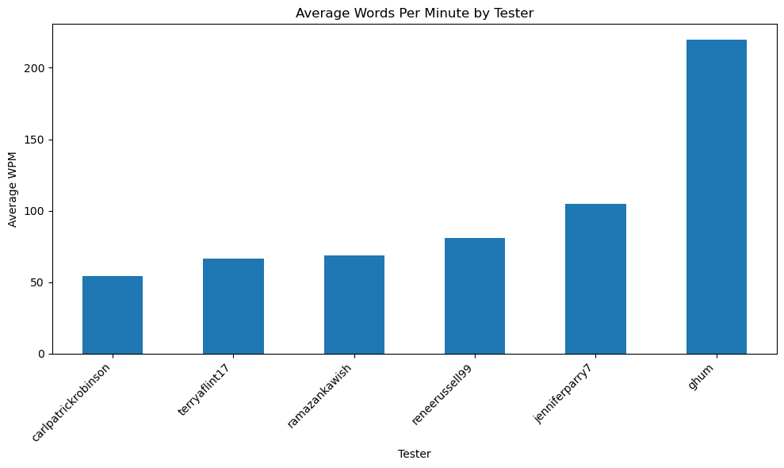
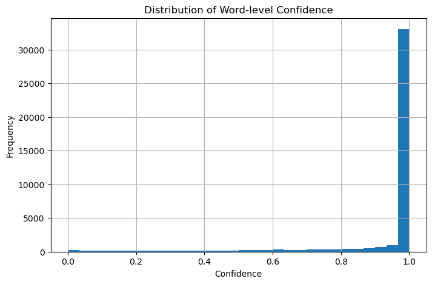
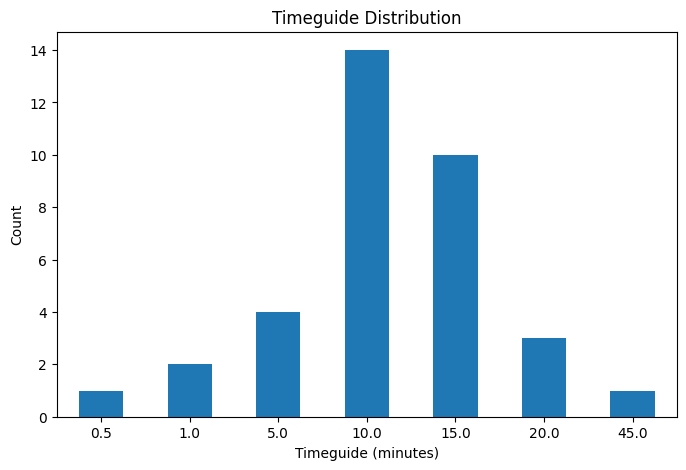
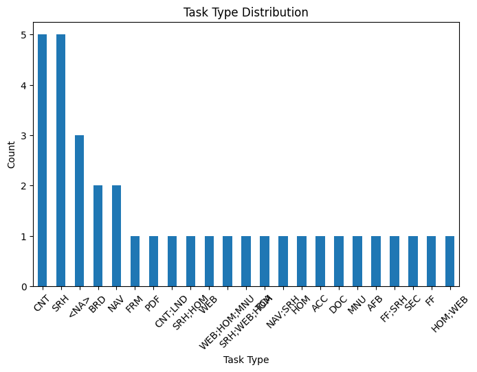

# EDA Report — CS20 Project
**Step 2.3 | Prepared by: Wanshi Liang (R8)**  
**Covers: Step 2.1 (Transcript Data) · Step 2.2 (Structured Data)**

---

## Overview

This report consolidates findings from the exploratory data analysis conducted across two notebooks. The transcript analysis focuses on six development-sample videos drawn from three client projects:

| Project | Development Samples |
|---|---|
| Department of Premier and Cabinet (WA) | `ghum_wa`, `reneerussell99_wa` |
| Suncorp Insurance | `terryaflint17_suncorp`, `carlpatrickrobinson_suncorp` |
| University of Queensland | `ramazankawish_uq`, `jenniferparry7_uq` |

All transcript analysis is restricted to these six development-sample videos. Structured-data analysis covers the broader dataset (57 videos, multiple testers) but highlights findings most relevant to later rule design and development-sample interpretation.

In addition to the transcript-based EDA on the six development samples, the structured-data EDA examines project-level task design, Timeguide patterns, tester participation, and duration deviation across the broader 57-video dataset.

---

## 1. Dataset Scale & Coverage

- **Window-level records:** 331 transcript windows / 326 audio-feature windows (near-complete join)
- **Item-level records:** 49,315 pronunciation items (40,997 after filtering to `type=pronunciation`)
- **Segment-level records:** 2,932 segments
- All key transcript-analysis tables were verified to contain exactly 6 unique `video_id` values after filtering, confirming correct scope
- Structured-data analysis currently has **full local metadata coverage for the 3 development projects only**
- `bupa-uk` is represented locally by a survey bundle only (no local `projects/tasks/assignments` files); Brighton has raw videos only and is excluded from structured-data EDA
- AAMI / Suncorp survey files are not present in the current local snapshot; survey EDA covers **UQ and Bupa only**

> ✅ No major structural gaps were identified. The dataset is suitable for preliminary Layer 1 rule development.

---

## 2. Data Quality Issues

### 2.1 Anomalous Speech Rate — `ghum_wa`

**`ghum_wa` shows an average WPM of approximately 220**, which is substantially higher than the other development samples. This is the clearest anomaly observed in the transcript EDA.

Possible explanations include:
- window-duration miscalculation
- overlapping or densely packed segments inflating word density
- multiple speakers or interviewer turns appearing in the transcript
- genuinely fast speech

**Action required before W9:** verify `ghum_wa` against raw timestamps and segment boundaries. This feature should not be treated as a stable modelling signal until validated.

The chart below compares average WPM across the six development-sample testers. Since one target video is retained per tester in this notebook, tester-level comparison here corresponds directly to the six development samples.

---

### 2.2 Low Transcription Confidence at Word Level

Window-level average confidence appears generally healthy across the development set, but word-level analysis reveals a more mixed pattern:

| Confidence threshold | Proportion of words below |
|---|---|
| < 0.5 | **5.6%** of all words |
| < 0.8 | **12.0%** of all words |

The histogram below shows the full word-level confidence distribution across the six development samples.

This suggests that the current `LOW_AUDIO_QUALITY` threshold of **0.7** may be too permissive. A noticeable proportion of words already fall below 0.8, which means a 0.7 window-average cutoff may miss borderline low-quality cases.

**Outcome:** threshold raised to **0.75** (applied 2026-04-22 per Step 3.2 validation). Word-level low-confidence ratio can be considered as a supplementary feature in later modelling.

---

### 2.3 Duration Deviation — Structured Data

Across the structured-data analysis, actual recording durations are substantially **shorter** than Timeguide expectations, with a **mean duration ratio of 0.53** and a median of **0.62**. In the current 15-video local snapshot, the main deviation pattern is on the low side: three videos fall below the 0.3 threshold, while no videos exceed 3.0×.

| Video | Project | duration_ratio | Flag |
|---|---|---:|---|
| `carlpatrickrobinson` (UQ) | the-university-of-queensland | 0.146 | ✅ `DURATION_ANOMALY` |
| `jenniferparry7` (UQ) | the-university-of-queensland | 0.159 | ✅ `DURATION_ANOMALY` |
| `carlpatrickrobinson` (Suncorp) | suncorp-insurance | 0.144 | ✅ `DURATION_ANOMALY` |

These three cases are all genuinely short recordings and are correctly captured by the Layer 1 `DURATION_ANOMALY` rule (`duration_ratio < 0.3`). No videos in the current snapshot exceed the upper threshold of 3.0×.

The chart below shows the distribution of Timeguide values across the structured dataset, providing context for understanding why Timeguide alone is not a strict quality baseline.

**Takeaway:** Recording durations in the current dev snapshot are consistently shorter than Timeguide expectations. The `DURATION_ANOMALY` rule correctly identifies the three extreme short-recording cases. Timeguide should be treated as a loose reference only.

---

## 3. Outliers & Prototype Cases

| Sample / Case | Feature | Value | Interpretation |
|---|---|---|---|
| `terryaflint17_suncorp` | narration_density | **0.233** | `SPARSE_NARRATION` prototype |
| `ghum_wa` | words_per_minute | **~220 WPM** | needs verification |
| several windows | silence_ratio | right-skewed distribution | high-silence windows observed |
| `carlpatrickrobinson` (×2) + `jenniferparry7` | duration_ratio | 0.144–0.159 | `DURATION_ANOMALY` flagged (< 0.3) |

Among the prototype cases listed above, `terryaflint17_suncorp` is the clearest sparse-narration example in the development set. With a narration density of about 0.23, it falls comfortably below a reasonable sparse-narration boundary and provides a useful calibration anchor for later Layer 1 rule validation.

---

## 4. Implications for Layer 1 Rule Design

The following threshold suggestions are based on development-sample EDA findings only. They should be treated as **preliminary calibration points** rather than final full-dataset rules.

### Narration Density (`SPARSE_NARRATION`)
- **Suggested threshold:** ≤ 0.30–0.35
- **Rationale:** `terryaflint17_suncorp` at 0.23 is clearly sparse, while testers with moderate narration density would not be over-flagged under this range

### Speech Rate (`HIGH_SPEECH_RATE`)
- **Suggested threshold:** ≥ 200 WPM
- **Rationale:** tester-level variation is large, but `ghum_wa` is the only clear high-end anomaly; this should remain provisional until the WPM calculation is verified

### Audio Quality (`LOW_AUDIO_QUALITY`)
- **Suggested threshold:** word-level confidence < 0.75–0.80, aggregated as a ratio per window
- **Rationale:** the current 0.7 window-average threshold appears too lenient relative to the observed 12% of words below 0.8

### Silence (`LONG_SILENCE`)
- Existing silence-based rules appear broadly reasonable for the development set
- High-silence windows and sparse-narration windows may overlap, so Layer 1 rule documentation should note the possibility of double-flagging

### Duration (`DURATION_ANOMALY`)
- Extreme short-recording deviations (ratio < 0.3) are present: 3 videos flagged in the current 15-video snapshot
- No videos exceed the upper threshold of 3.0× in the current snapshot
- Timeguide should be treated as a loose reference only; the mean duration ratio of 0.53 across the dev snapshot reflects genuine session-length variation rather than data error

---

## 5. Cross-Project Structural Notes

The structured-data EDA reveals several cross-project patterns across the 3 development projects and adds a lighter survey-coverage comparison for the locally available UQ and Bupa bundles.

Within the current local snapshot, this means:
- the core project/task/tester comparisons remain restricted to WA, Suncorp, and UQ
- UQ and Bupa can be compared at the **survey-structure** level; both have 43 questions and 20 completed responses
- AAMI / Suncorp survey files are **not present locally**; survey conclusions should be framed as partial coverage until those files are available
- Brighton remains out of scope for Step 2.2 because only raw videos are available locally

| Project | Tester Count | Task Count | Mean Timeguide (min) | Median Timeguide (min) | Notes |
|---|---:|---:|---:|---:|---|
| Department of Premier and Cabinet (WA) | 17 | 14 | 9.36 | 10.0 | relatively shorter Timeguides |
| Suncorp Insurance | 21 | 11 | 10.95 | 10.0 | moderate project scale |
| University of Queensland | 19 | 10 | 16.60 | 15.0 | longest Timeguides; max 45 min |

| Structural Aspect | Key Finding | Implication |
|---|---|---|
| Cross-project participation | 18 testers appear across multiple projects | useful for later cross-project comparison |
| Task labels | labels are fragmented / compound | task-type normalisation may be needed |
| Timeguide | mean = 11.93 min, median = 10 min, max = 45 min | project context should be considered in duration interpretation |
| Survey coverage | UQ (43 questions, 20 responses) + Bupa (43 questions, 20 responses) locally available | AAMI / Suncorp survey files not present in current snapshot |

- Tester counts are broadly comparable across the three client projects, while task counts vary slightly according to project scope.
- **18 testers appear across multiple projects**, which may support later cross-project performance tracking.
- Task-type analysis shows that labels are not fully standardised across the structured dataset. The most common task types are `CNT` and `SRH` (5 each), followed by `<NA>` (3 tasks with no type assigned), then `BRD` and `NAV` (2 each), with the remaining 18 types appearing only once — many as compound labels such as `CNT;LND`, `WEB;HOM;MNU`, and `NAV;SRH`.
- This fragmented task-type structure suggests that task-type normalisation is likely to be necessary before task-related features are used in later modelling.
- UQ tasks have longer Timeguides on average than WA and Suncorp, which suggests that project context should be considered when interpreting duration-related behaviour.

The chart below shows the task-type distribution across the structured dataset and highlights the fragmented nature of task labels.

---

## 6. Summary for W7 Client Meeting

| Theme | Key Finding |
|---|---|
| Data coverage | Six development-sample videos successfully loaded; 49K+ word-level records available |
| Structured-data scope | Full structured EDA currently covers WA / Suncorp / UQ; Bupa is survey-only and Brighton is excluded |
| Biggest quality flag | `ghum_wa` WPM ~220, which requires verification before modelling |
| Threshold to revisit | `LOW_AUDIO_QUALITY` at 0.7 appears too lenient; ~12% of words fall below 0.8 |
| Best prototype case | `terryaflint17_suncorp` narration_density ≈ 0.23, which anchors `SPARSE_NARRATION` calibration |
| Structural finding | Recording durations in the dev snapshot average 0.53× Timeguide (shorter than expected); 3 videos flagged as `DURATION_ANOMALY` (< 0.3) |
| Survey coverage | UQ + Bupa survey EDA available; AAMI / Suncorp survey files not present locally |
| Layer 1 outcome | `LOW_AUDIO_QUALITY` threshold raised 0.7 → 0.75, `SPARSE_NARRATION` raised 0.2 → 0.3 (applied 2026-04-22); total flags 214 → 278 |
| Next step | verify the `ghum_wa` WPM anomaly; Step 5.3 R8 annotation complete; Kappa pending R3 canonical re-annotation |

---

## 7. Conclusion

The combined EDA findings show that the development-sample data is suitable for early rule design, but several signals require careful interpretation before finalisation.  
The clearest actionable findings are the sparse-narration prototype in `terryaflint17_suncorp`, the unusually high WPM in `ghum_wa`, the non-trivial proportion of low-confidence words, and the weak usefulness of Timeguide as a strict duration baseline.  
Together, these observations provide a practical foundation for the next step of Layer 1 rule calibration and validation.

---

*Sources: `01_transcript_eda.ipynb` (Step 2.1) · `02_structured_data_eda.ipynb` (Step 2.2)*
